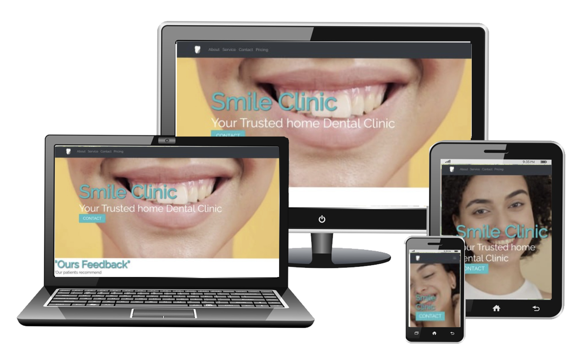
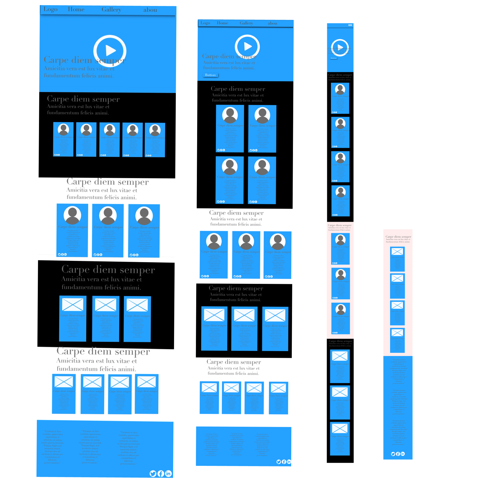
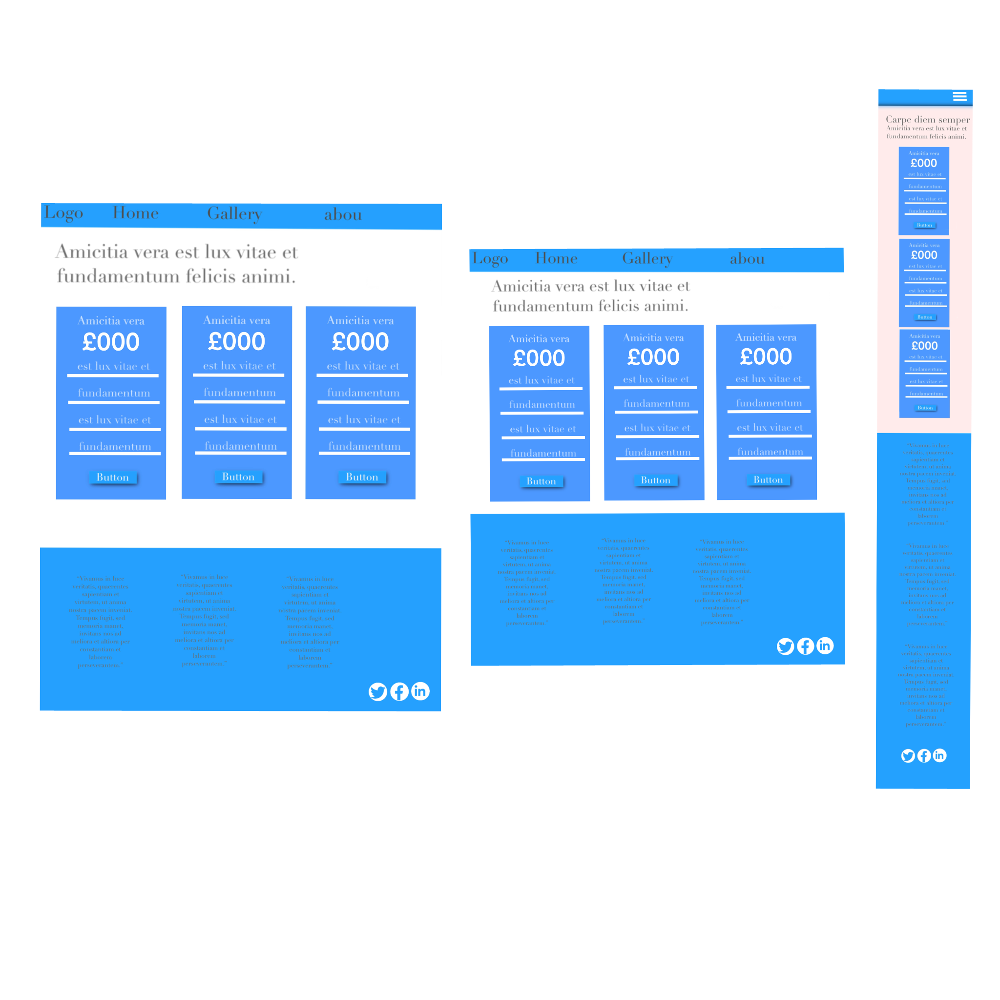
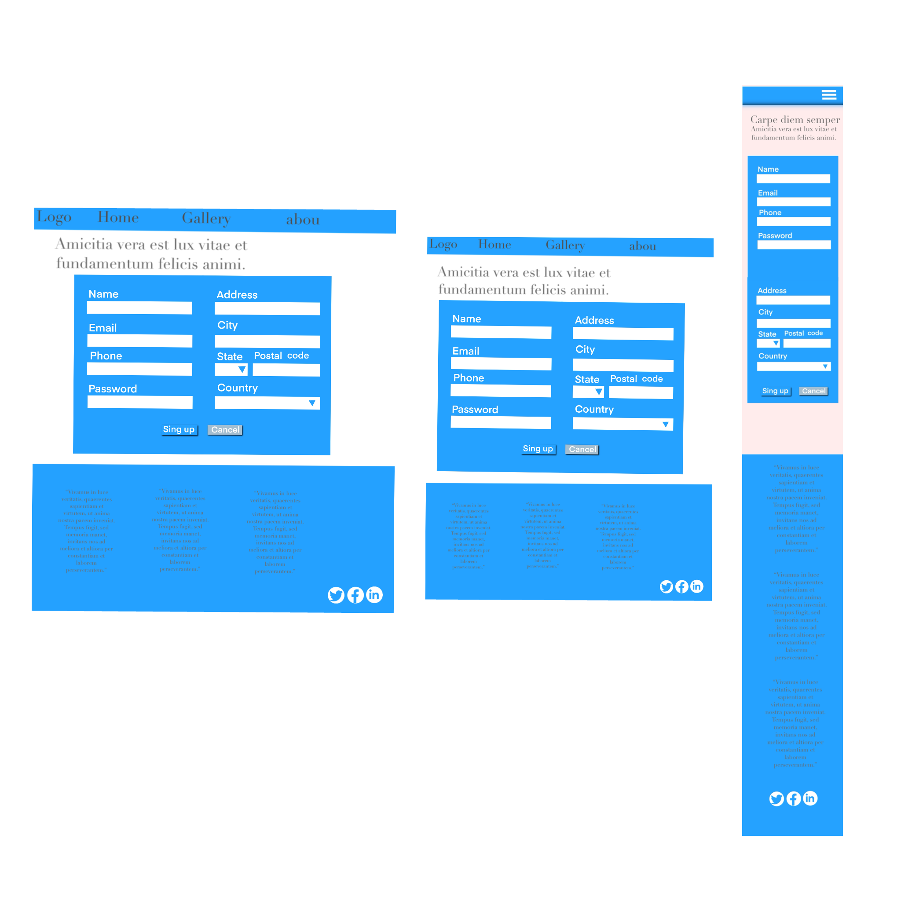

# Smile Clinic Website

[View the live project here.](https://github.com/ToniEstarlich/Smile-Clinic.github.io)

The Smile Clinic website is a fictional dental clinic webpage designed to introduce the clinic, its services, and its team. It features a homepage with details about the clinic, a contact page, and a pricing page. Users are redirected to a "payment successful" page upon completing a payment or to a "form submitted" page after submitting the contact form.

---

## User Experience (UX)

### 🖥️ Screenshots: Fully Responsive Design
The Smile Clinic website is fully responsive, adapting seamlessly to desktop, tablet, and mobile devices.

| Desktop View | Tablet View | Mobile View |
|--------------|-------------|-------------|
|  |  |  |

---

### User Stories

#### First Time Visitor Goals
1. Understand the main purpose of the site and learn more about the organization.
2. Easily navigate throughout the site to find content.
3. Access testimonials and social media links to verify the clinic's credibility.

#### Returning Visitor Goals
1. Find contact information and pricing plans.
2. Locate forms to send queries or feedback.
3. Check the clinic's services and updates.

#### Frequent User Goals
1. Easily contact the clinic.
2. Navigate the website intuitively to explore monthly pricing plans.
3. Stay updated on new offers or features.

---

## Design

### Colour Scheme
- Soft Yellow (#fbe49e)
- Aqua (#4abec2)
- Dark Gray (#323338)
- White (#ffffff)

### Typography
The Smile Clinic website uses the **Raleway** font as the primary typeface, paired with a fallback of **Sans-serif**. 
Raleway ensures readability and adds a contemporary feel, while the sans-serif fallback guarantees compatibility across various devices.

To include the font in the project, it is loaded via Google Fonts:

<link href="https://fonts.googleapis.com/css2?family=Raleway:wght@400;700&display=swap" rel="stylesheet">

---
## Imagery

### Home Page

- **Hero Section**: The background of the hero section features a video, showcasing a smiling woman to evoke the importance of healthy teeth. The video conveys feelings of familiarity, friendliness, positivity, and optimism.
- **Patient Feedback**: Below the header, we feature feedback from our patients, including their recommendations along with their respective photo and card.
- **Professional Introductions**: Following the patient feedback, we display images with corresponding cards introducing our professional team.
- **Services Explanation**: After the introduction of our professionals, we highlight the services offered, such as Orthodontics, Cosmetic Dentistry, and Restorative Dentistry, accompanied by images.

### Contact Page

- **Google Map**: The contact section includes an embedded Google map image, making it easy for users to find our location.

## Wireframes

- 
- 
- 

## Features

- Fully responsive design on all device sizes.
- Interactive elements to enhance user experience.

## Technologies Used

### Languages

- [HTML5](https://en.wikipedia.org/wiki/HTML5)
- [CSS3](https://en.wikipedia.org/wiki/Cascading_Style_Sheets)

### Frameworks, Libraries, and Tools

1. [Bootstrap 4.4.1](https://getbootstrap.com/docs/4.4/getting-started/introduction/)
   - Used for responsive design and styling.
2. [Hover.css](https://ianlunn.github.io/Hover/)
   - Adds float transition effects to social media icons in the footer.
3. [Google Fonts](https://fonts.google.com/)
   - Used to import the 'Montserrat' font.
4. [Font Awesome](https://fontawesome.com/)
   - Used to enhance the design with icons.
5. [Git](https://git-scm.com/)
   - Version control system.
6. [GitHub](https://github.com/)
   - Hosting the project code.
7. [Photoshop](https://www.adobe.com/products/photoshop.html)
   - Used for logo creation and image editing.
8. [Procreate](https://Procreate.com/)
   - Used to create wireframes.
9. [Microsoft Clipchamp](https://www.microsoft.com/en-us/clipchamp)
   - Edited and resized the header video to optimize performance.

## Testing

### Validators

#### Visual Testing and Browser Inspection

- Tested the project in Google Chrome to ensure all HTML and CSS code is functioning as expected.
- Manual testing for responsiveness by resizing the browser window to simulate different screen sizes.
- Used developer tools for debugging and adjusting styles on-the-fly.

#### Code Validation

- **HTML Validation**: The HTML code was validated using the [W3C Markup Validator](https://validator.w3.org/nu/?doc=https%3A%2F%2Fgithub.com%2FToniEstarlich%2FSmile-Clinic.github.io), with no critical errors.
- **CSS Validation**: The CSS code passed validation with the [W3C CSS Validator](https://jigsaw.w3.org/css-validator/validator?uri=https%3A%2F%2Fgithub.com%2FToniEstarlich%2FSmile-Clinic.github.io&profile=css3svg&usermedium=all&warning=1&vextwarning=&lang=en).

#### Browser and Device Testing

- Tested on Google Chrome, Internet Explorer, Microsoft Edge, and Safari.
- Checked on desktop, laptop, tablet, and smartphone devices.
- Thorough testing of links and navigation for functionality.

### Known Bugs

- Hero video causes layout issues on some mobile devices.
- Links in the Navbar are misaligned on Microsoft Edge and Internet Explorer.

### Issues Encountered During Setup

- During the process of pushing the latest changes to the repository, issues arose after relocating the project to a new directory. This led to conflicts between the local and remote branches.
- To resolve this, I had to pull updates from the remote repository, merge the changes, and then successfully push the latest updates.

## Deployment

### GitHub Pages Deployment

1. Log in to GitHub and navigate to the repository.
2. Go to the **Settings** tab.
3. Scroll to the **Pages** section.
4. Select the main branch and click **Save**.
5. The deployed site will be available at the provided link.

## Logo

The logo was designed specifically for the dental clinic. It is simple and minimalist, using only two colors: white and grey. The logo can be easily customized with different colors. You can view the logo here: 
![SCWB Logo] 

## Video

The video used in the hero section was edited using **Clipchamp** and sourced from the free stock videos available on **Pexels**:
[Visit Pexels](https://www.pexels.com/)

## GitHub Links

- [Webpage](https://github.com/ToniEstarlich/Smile-Clinic.github.io)
- [Repository](https://github.com/ToniEstarlich/Smile_Clinic)

## Folders and Files

### /CSS
- checkout.css
- contact.css
- footer.css
- nav_var.css
- payment.css
- paysuccess.css
- price.css
- style.css
- testimonials.css

### /html
- /payment
  - Basic-Care-Plan.html
  - Bright-smile-Plan.html
  - Complete-Debtak-Health.html
  - pay-success.html
- contact.html
- message-success.html
- price.html

### /pictures
- Alex.jpg
- Emily.jpg
- form_imagen.jpg
- Sara.jpg
- SC.png
- SCWB.png
- map.jpg
- Orthodontics.jpg
- Restorative-Dentistry.jpg
- testimonial1.jpg
- testimonial2.jpg
- testimonial3.jpg
- testimonial4.jpg
- testimonial5.jpg

### /screenshots
- Screen-pc.jpeg
- Screen-smartphone.jpeg
- Screen-tablet.jpeg

### /videos
- SmileClinic480.mp4

### /wareframes
- Form-wareframes.PNG
- Home-wareframe.PNG
- Price-wareframe.PNG
- responsive.JPEG

### Other Files
- index.html
- README.md
