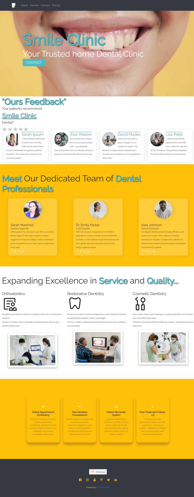
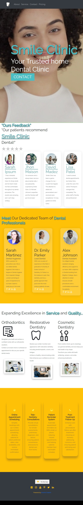
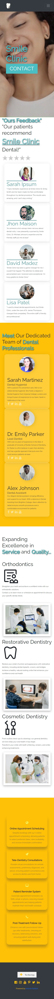

# Smile Clinic Dental Website

Welcome to the **Smile Clinic Dental** website repository! This project is a fictional website created to demonstrate the design and functionality of a modern dental clinic's online presence.

---

## 🌟 **Overview**

**Smile Clinic Dental** is a fictional dental clinic website designed to showcase features that a real-world dental practice might offer. It focuses on user-friendly design, clear navigation, and engaging content.

---

## ✨ **Features**

- **Home Page**: A welcoming overview of Smile Clinic Dental, including its mission, vision, and core services.
- **Services Page**: Comprehensive descriptions of fictional dental services tailored to patients' needs.
- **Testimonials Section**: Displaying mock reviews and feedback from satisfied patients.
- **Financial Information**: Clear details about fictional accepted insurance plans and payment options.
- **Post-Treatment Follow-Up**: Mock personalized care instructions to ensure excellent recovery.

---

## 🔧 **Technologies Used**

- **HTML5**: For structure and semantics.
- **CSS3**: For styling and layout.
- **Bootstrap**: For responsive design and components.
- **W3.CSS**: To ensure modern and clean design.

---

## 🖥️ **Screenshots**

### Fully Responsive Design

- **Desktop View**
- **Tablet View**- **Mobile View**

---

## 🚀 **Getting Started**

To view this project locally:

### 1️⃣ Clone the Repository:
```bash
git clone https://github.com/ToniEstarlich/Smile_Clinic
